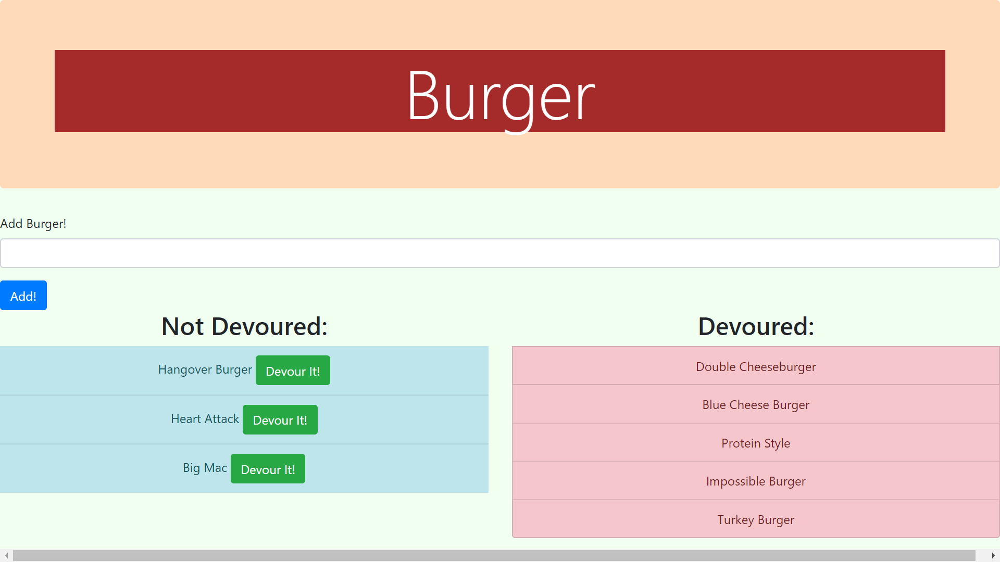

# Burger App

## Description
This app uses node.js and mysql2. This application allows users to add any type of burger they want to a list of burgers. They will also have a button called "Devour It!" which will then populate the burger to the other side of the app under the Devoured column. 

## Installation
The repo can be found at https://github.com/E-Park8/burger. Users can clone the repo and run npm in into the terminal to bring necessary npms. 
